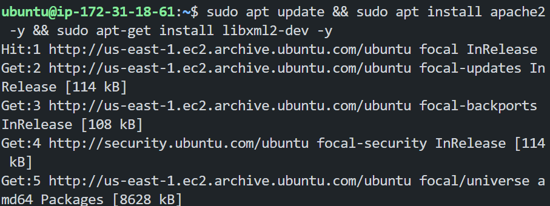
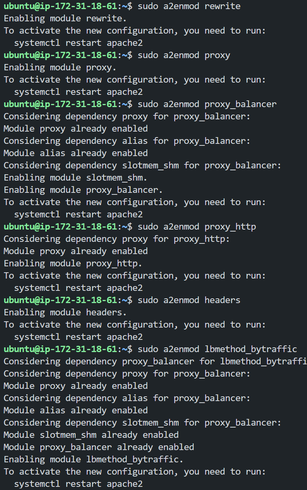
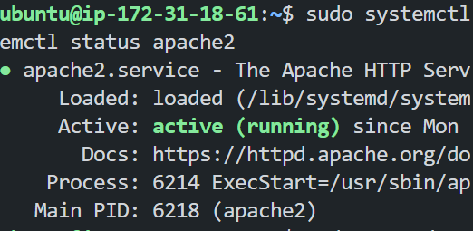
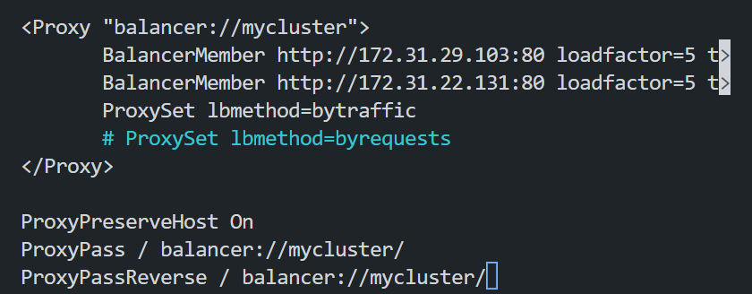
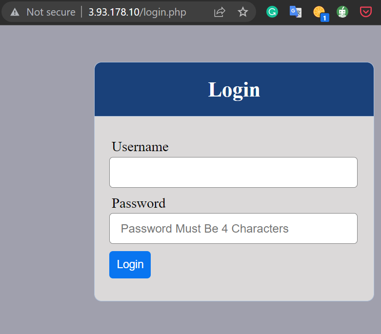
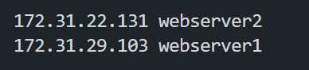
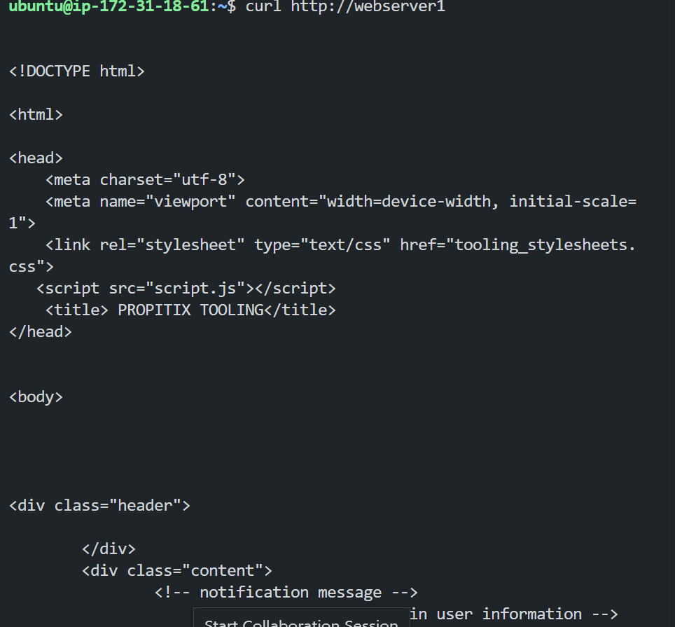

# Configuring Apache as a Load Balancer.

In this tutorial, we would work on configuring a load balancer.

# List of tasks
- Introduction
    - What is a load balancer?
- Prerequisites
- Configure Apache as a Load Balancer.
- Configure Local DNS Names Resolution.
- Conclusion

## Introduction
Load balancing refers to efficiently distributing incoming network traffic across a group of backend servers, also known as a server farm or server pool. Load balancing improves the overall performance of applications by ensuring that no single server is overwhelmed by excessive traffic. It also provides fault tolerance and high availability by ensuring that if one server fails, another is available to take over the processing of incoming requests.

### What is a load balancer?
A load balancer is a device that distributes network or application traffic across several servers. Load balancers are used to increase the capacity (concurrent users) and reliability of applications. They do this by distributing traffic across multiple servers (also known as a server farm or server pool). They act as a traffic cop sitting in front of your servers and routing client requests across all servers capable of fulfilling those requests in a manner that maximizes throughput, minimizes response time, and avoids overload of any single server.


## Prerequisites
To make this tutorial work, you need to have the following:
- Two RHEL8 web servers.
- One MySQL DB server(based on Ubuntu 20.04).
- One RHEL8 NFS server.
To configure this you can check out my previous tutorials: <a href="https://github.com/manny-uncharted/project-7-DEVOPS-TOOLING-WEBSITE-SOLUTION#introduction">Here</a>

## Configure Apache as a Load Balancer.
- Create an Ubuntu Server 20.04 LTS instance and name it 'project-8-apache-lb'.

    Results:
    

- Open TCP port 80 on project-8-apache-lb by creating an inbound rule in the security group.

    Results:
    

- Install apache load balancer on project-8-apache-lb and configure it to point traffic coming to LB to both web servers.
    ```
    sudo apt update
    sudo apt install apache2
    sudo apt-get install libxml2-dev
    ```

    Results:
    

- We need to enable the following modules
    ```
    sudo a2enmod rewrite
    sudo a2enmod proxy
    sudo a2enmod proxy_balancer
    sudo a2enmod proxy_http
    sudo a2enmod headers
    sudo a2enmod lbmethod_bytraffic
    ```
    Results:
    

- After enabling the modules, we need to configure the load balancer. we need to restart the apache service and check its status.
    ```
    sudo systemctl restart apache2
    sudo systemctl status apache2
    ```
    Results:
    

- Now it's time for us to configure the load balancer. We need to edit the file `/etc/apache2/sites-available/000-default.conf` and add the following lines. It should be in the VirtualHost section.
    ```
    <VirtualHost *:80>  

        <Proxy "balancer://mycluster">
            BalancerMember http://<WebServer1-Private-IP-Address>:80 loadfactor=5 timeout=1
            BalancerMember http://<WebServer2-Private-IP-Address>:80 loadfactor=5 timeout=1
            ProxySet lbmethod=bytraffic
            # ProxySet lbmethod=byrequests
        </Proxy>

        ProxyPreserveHost On
        ProxyPass / balancer://mycluster/
        ProxyPassReverse / balancer://mycluster/
    </VirtualHost>
    ```
    Results:
    

    Note: You can use either `bytraffic` or `byrequests` as the load balancing method. I used `bytraffic` in this tutorial. As the bytraffic balancing method will distribute incoming load between your Web Servers according to the current traffic load. We can control in which proportion the traffic must be distributed by loadfactor parameter.

- To test the load balancer, we need to open the browser and type the public IP address of the load balancer. You should see the following page.

    ```
    http://<LoadBalancer-Public-IP-Address>/index.php
    ```

    Results:
    

    At this point, our load balancer is configured properly.

    Note: Try to refresh your browser page http://<Load-Balancer-Public-IP-Address-or-Public-DNS-Name>/index.php several times and make sure that both servers receive HTTP GET requests from your LB – new records must appear in each server’s log file. The number of requests to each server will be approximately the same since we set loadfactor to the same value for both servers – it means that traffic will be distributed evenly between them.

    If you have configured everything correctly – your users will not even notice that their requests are served by more than one server.


## Configure Local DNS Names Resolution.
It can be very tedious to remember and switch between IP addresses, especially if you're managing multiple servers. In this section, we would configure local DNS names resolution. The easiest approach is to use the /etc/hosts file, though this approach isn't scalable, it is very much easy to configure and it works well for small environments.

- On our load balancer server open the /etc/hosts file and add the following lines.
    ```
    <WebServer1-Private-IP-Address> webserver1
    <WebServer2-Private-IP-Address> webserver2
    ```
    Results:
    

- Now we can update our load balancer config file with the new DNS names.
    ```
    <VirtualHost *:80>  

        <Proxy "balancer://mycluster">
            BalancerMember http://webserver1:80 loadfactor=5 timeout=1
            BalancerMember http://webserver2:80 loadfactor=5 timeout=1
            ProxySet lbmethod=bytraffic
            # ProxySet lbmethod=byrequests
        </Proxy>

        ProxyPreserveHost On
        ProxyPass / balancer://mycluster/
        ProxyPassReverse / balancer://mycluster/
    </VirtualHost>
    ```
    Results:
    

    Now you can restart the apache service and test the load balancer again.

    ```
    curl http://webserver1
    curl http://webserver2
    ```
    Note: this configuration is internal and only local to the load balancer server. It will not work from outside the load balancer server.

    Results:
    


## Conclusion
In this tutorial, we have configured a load balancer to distribute traffic between two web servers. We have also configured local DNS names resolution to make it easier to access the web servers.