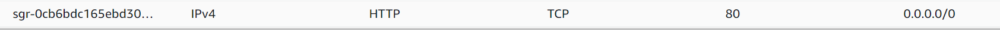

# Configuring Apache as a Load Balancer.

In this tutorial, we would work on configuring a load balancer.

# List of tasks
- Introduction
    - What is a load balancer?
- Prerequisites
- Configure Apache as a Load Balancer.
- 

## Introduction
Load balancing refers to efficiently distributing incoming network traffic across a group of backend servers, also known as a server farm or server pool. Load balancing improves the overall performance of applications by ensuring that no single server is overwhelmed by excessive traffic. It also provides fault tolerance and high availability by ensuring that if one server fails, another is available to take over the processing of incoming requests.

### What is a load balancer?
A load balancer is a device that distributes network or application traffic across several servers. Load balancers are used to increase the capacity (concurrent users) and reliability of applications. They do this by distributing traffic across multiple servers (also known as a server farm or server pool). They act as a traffic cop sitting in front of your servers and routing client requests across all servers capable of fulfilling those requests in a manner that maximizes throughput, minimizes response time, and avoids overload of any single server.

## Prerequisites
To make this tutorial work, you need to have the following:
- Two RHEL8 web servers.
- One MySQL DB server(based on Ubuntu 20.04).
- One RHEL8 NFS server.
To configure this you can check out my previous tutorials: <a href="https://github.com/manny-uncharted/project-7-DEVOPS-TOOLING-WEBSITE-SOLUTION#introduction">Here</a>

## Configure Apache as a Load Balancer.
- Create an Ubuntu Server 20.04 LTS instance and name it 'project-8-apache-lb'.

    Results:
    

- Open TCP port 80 on project-8-apache-lb by creating an inbound rule in the security group.

    Results:
    

- Install apache load balancer on project-8-apache-lb and configure it to point traffic coming to LB to both web servers.

    Results:
    